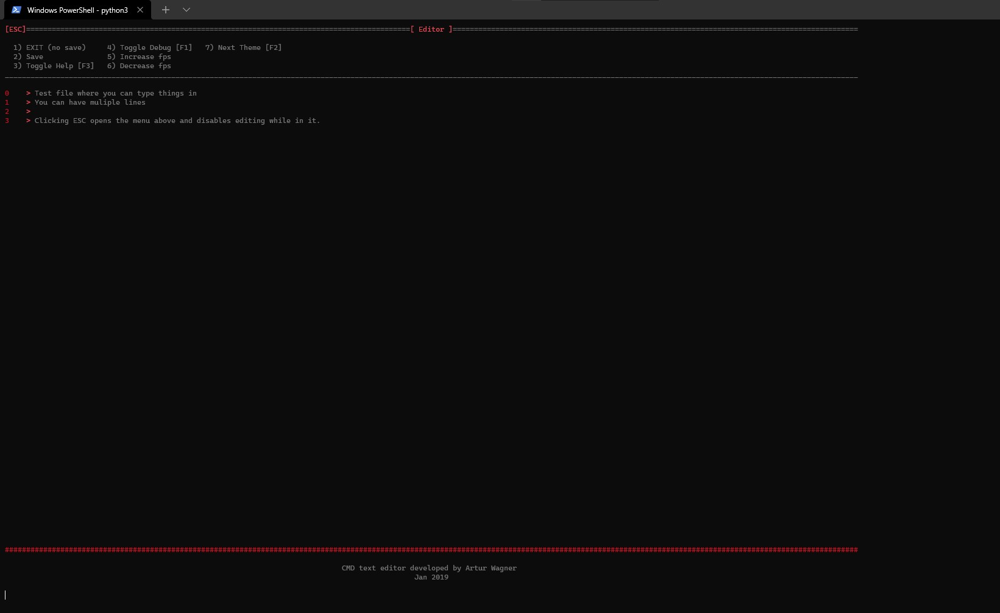

# Command prompt editor 2019

NOTE: Tested on Window 8.1 with Python 3.5.2 and Windows 10 with python 3.8.8

Application can be run by going into /editor2 and running:


```
python main.py filename.txt
```
Dependencies 
+ re
+ colorama
+ getch

On win 8 cmd should resize automatically but on win 10 you can use ctrl+scroll to zoom in/out

</img>
